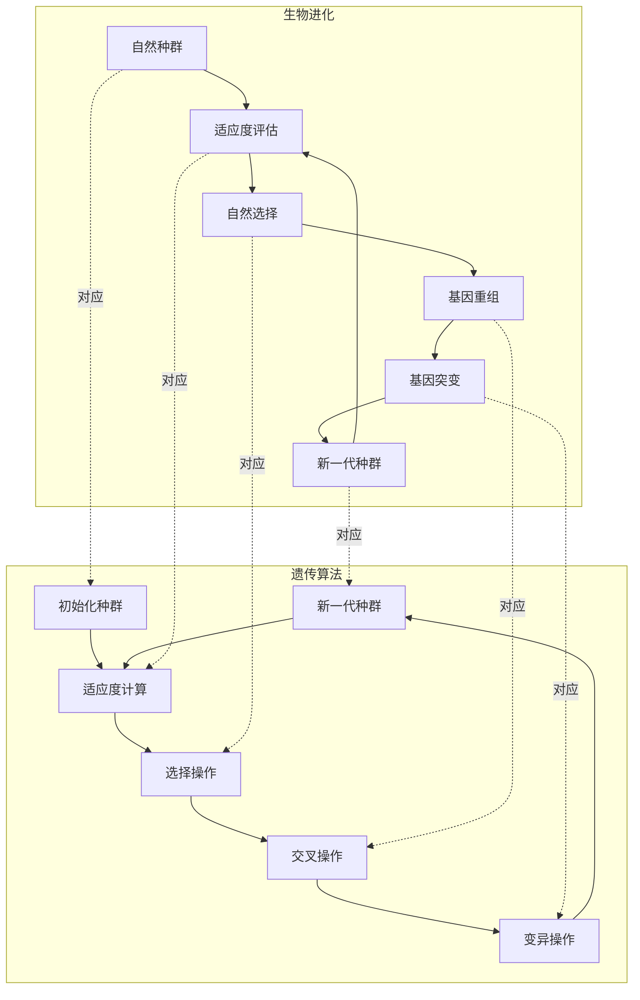

# 遗传算法详解

## 第一章：遗传算法基础概念

### 1.1 什么是遗传算法
遗传算法(Genetic Algorithm, GA)是一种模拟达尔文生物进化论的自然选择和遗传学机制的计算模型，是一种通过模拟自然进化过程搜索最优解的方法。

[生物进化与遗传算法的对应关系示意图]




详细对应关系说明：

| 生物进化 | 遗传算法 | 说明 |
|---------|----------|------|
| 自然种群 | 初始化种群 | 个体的集合 |
| 适应度评估 | 适应度计算 | 评价个体的优劣 |
| 自然选择 | 选择操作 | 优胜劣汰 |
| 基因重组 | 交叉操作 | 产生新的个体 |
| 基因突变 | 变异操作 | 维持多样性 |
| 新一代种群 | 新一代种群 | 进化的结果 |

主要特点：
1. 两个过程都是迭代的
2. 都遵循"适者生存"的原则
3. 都通过重组和变异产生新的个体
4. 都是群体性的进化过程

这种对应关系使得遗传算法能够很好地模拟自然进化过程，从而解决复杂的优化问题。

### 1.2 基本术语
- **染色体(Chromosome)**：问题的一个可能解，通常用编码表示
- **基因(Gene)**：染色体中的一个元素
- **种群(Population)**：多个染色体的集合
- **适应度(Fitness)**：评价染色体好坏的标准
- **选择(Selection)**：优胜劣汰的过程
- **交叉(Crossover)**：两个染色体交换部分基因
- **变异(Mutation)**：染色体中的基因发生随机变化


## 第二章：遗传算法的工作原理

### 2.1 基本流程
1. 初始化种群
2. 计算适应度
3. 选择操作
4. 交叉操作
5. 变异操作
6. 重复步骤2-5直到满足终止条件

[遗传算法工作流程图]


```
┌──────────────────────────────────────────────────┐
│                  开始                            │
└──────────────────┬───────────────────────────────┘
                   ↓
┌──────────────────────────────────────────────────┐
│              初始化种群                          │
│     随机生成N个染色体组成初始种群                │
└──────────────────┬───────────────────────────────┘
                   ↓
┌──────────────────────────────────────────────────┐
│              适应度评价                          │
│     计算种群中每个个体的适应度值                 │
└──────────────────┬───────────────────────────────┘
                   ↓
┌──────────────────────────────────────────────────┐
│              选择操作                            │
│     根据适应度选择优秀个体进入下一代             │
└──────────────────┬───────────────────────────────┘
                   ↓
┌──────────────────────────────────────────────────┐
│              交叉操作                            │
│     选择两个父代个体，进行基因交换               │
└──────────────────┬───────────────────────────────┘
                   ↓
┌──────────────────────────────────────────────────┐
│              变异操作                            │
│     以一定概率改变某些基因的值                   │
└──────────────────┬───────────────────────────────┘
                   ↓
┌──────────────────────────────────────────────────┐
│           是否满足终止条件？                     │
│    (迭代次数/适应度阈值/收敛程度)               │
└──────────────────┬───────────────────────────────┘
                   ↓
        ┌──────────┴───────────┐
        │                      │
        ↓ 否                   ↓ 是
┌─────────────────┐    ┌──────────────────────┐
│  返回适应度评价  │    │       输出结果       │
└────────┬────────┘    └──────────┬───────────┘
         │                        ↓
         │                ┌──────────────────────┐
         │                │        结束          │
         │                └──────────────────────┘
         └────────────────┐
                         ↓
```

说明：
1. **初始化种群**：随机生成第一代种群
2. **适应度评价**：评估每个个体的优劣程度
3. **选择操作**：优胜劣汰，保留优秀个体
4. **交叉操作**：模拟基因重组
5. **变异操作**：维持种群多样性
6. **终止条件**：
   - 达到最大迭代次数
   - 最优解满足要求
   - 种群收敛（多样性下降）

这个流程是一个迭代过程，直到满足终止条件才会停止。每一代都会产生更优秀的个体，逐步接近最优解。


```python
import numpy as np

class GeneticAlgorithm:
    def __init__(self, pop_size, chromosome_length):
        self.pop_size = pop_size
        self.chromosome_length = chromosome_length
        self.population = np.random.randint(2, size=(pop_size, chromosome_length))
    
    def calculate_fitness(self, chromosome):
        # 这里以求解最大值为例
        return sum(chromosome)
    
    def select(self):
        # 轮盘赌选择
        fitness = [self.calculate_fitness(chrom) for chrom in self.population]
        total_fitness = sum(fitness)
        prob = [f/total_fitness for f in fitness]
        selected = np.random.choice(len(self.population), size=self.pop_size, p=prob)
        self.population = self.population[selected]
```

## 第三章：编码方式

### 3.1 二进制编码
最常用的编码方式，将解空间映射到二进制串。

### 3.2 实数编码
直接用实数表示染色体，适用于连续优化问题。

### 3.3 排列编码
用于解决TSP等排列组合问题。

## 第四章：选择操作

### 4.1 轮盘赌选择
根据适应度大小按比例选择。

### 4.2 锦标赛选择
随机选择若干个体进行比较。

### 4.3 精英保留
保留最优个体。

## 第五章：交叉操作

### 5.1 单点交叉
```python
def crossover(parent1, parent2):
    point = np.random.randint(len(parent1))
    child1 = np.concatenate([parent1[:point], parent2[point:]])
    child2 = np.concatenate([parent2[:point], parent1[point:]])
    return child1, child2
```

### 5.2 多点交叉
在多个位置进行交叉操作。

### 5.3 均匀交叉
随机交换父代的基因。

## 第六章：变异操作

### 6.1 基本变异
```python
def mutate(chromosome, mutation_rate):
    for i in range(len(chromosome)):
        if np.random.random() < mutation_rate:
            chromosome[i] = 1 - chromosome[i]  # 翻转基因
    return chromosome
```

## 第七章：参数设置

### 7.1 关键参数
- 种群大小
- 交叉概率
- 变异概率
- 终止条件

### 7.2 参数调优
不同问题需要不同的参数设置。

## 第八章：应用实例

### 8.1 函数优化
```python
# 求解函数最大值
def optimize_function():
    ga = GeneticAlgorithm(pop_size=100, chromosome_length=20)
    for generation in range(100):
        ga.select()
        ga.crossover()
        ga.mutate()
    return ga.get_best()
```

### 8.2 旅行商问题(TSP)
### 8.3 背包问题
### 8.4 调度问题

## 第九章：高级主题

### 9.1 多目标优化
### 9.2 并行遗传算法
### 9.3 混合算法

## 第十章：总结与展望

### 10.1 优点
- 并行性
- 全局搜索能力
- 适应性强

### 10.2 局限性
- 参数设置难
- 收敛速度慢
- 可能早熟收敛

### 10.3 未来发展方向
- 与深度学习结合
- 参数自适应
- 新的编码方式

这本书涵盖了遗传算法的基本概念、工作原理、关键操作和实际应用。通过学习这些内容，你可以掌握遗传算法的核心思想，并能够将其应用到实际问题中。
